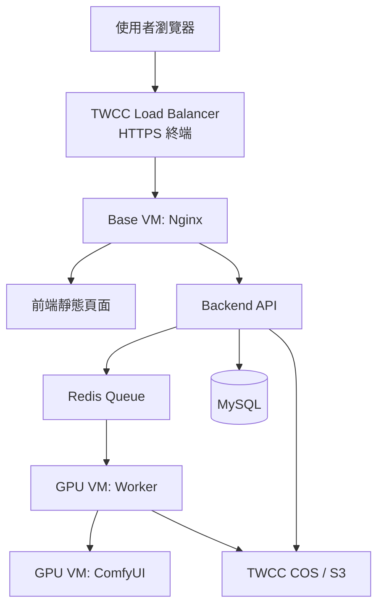
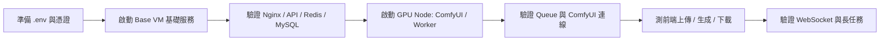

# TWCC MVP 補強版部署與驗證手冊

> 適用範圍：Single Web Node + Single GPU Node 的 TWCC MVP
>
> 本文件整合本次 hardening change 的執行框架、部署策略、啟動流程、驗證方式與故障排除，供下一位 Agent、DevOps 或維運工程師直接接手。

---

## 1. 文件目標

這份手冊回答五件事：

1. 目前 TWCC MVP 的正式執行框架是什麼。
2. CPU Web Node 與 GPU Node 各自負責哪些服務。
3. 正確的啟動順序與設定順序是什麼。
4. 上線前與上線後要怎麼測。
5. 常見失敗點應該從哪裡排查。

---

## 2. 架構總覽

### 2.1 元件責任圖



### 2.2 實際執行框架

| 節點 | 角色 | 啟動方式 | 主檔 |
|------|------|---------|------|
| CPU Web Node | 前端入口、API、Redis、MySQL | Docker Compose | `docker-compose.base.yml` |
| GPU Node | ComfyUI、Worker | systemd 或 GPU 節點本地啟動 | 非 `docker-compose.base.yml` |
| Unified Compose | 開發與單機 Linux 參考 | Docker Compose Profiles | `docker-compose.unified.yml` |

### 2.3 關鍵結論

1. TWCC 生產 Web Node 的 source of truth 是 `docker-compose.base.yml`。
2. `docker-compose.unified.yml` 不是目前 TWCC Web Node 的正式 runtime 檔。
3. 前端雲端環境必須走同源 API 路徑。
4. 長任務穩定性取決於 Nginx timeout、Worker HTTP timeout、`WORKER_TIMEOUT` 三層同時對齊。

---

## 3. 本次補強內容

### 3.1 Nginx 補強

已要求 Web Node 具備：

1. `client_max_body_size 50M`
2. `proxy_read_timeout 300s`
3. `proxy_connect_timeout 300s`
4. `proxy_send_timeout 300s`
5. `/ws/` WebSocket 代理
6. `server_tokens off`

### 3.2 Compose 日誌輪替

所有長駐服務都應加上：

```yaml
logging:
  driver: "json-file"
  options:
    max-size: "10m"
    max-file: "3"
```

目的：

1. 防止 Base VM 日誌長期堆積。
2. 保持 Base / unified 兩條運行路徑的一致性。

### 3.3 Worker Timeout 補強

分成兩種 timeout：

1. `COMFY_HTTP_TIMEOUT`
   - 控制對 ComfyUI 的 HTTP API 呼叫
   - 建議 300 秒

2. `WORKER_TIMEOUT`
   - 控制整個生成流程等待時間
   - 建議 3600 秒

### 3.4 前端同源策略

規則如下：

1. 雲端、Nginx、LB 下，一律使用相對 API 路徑。
2. 只有本機非 5000 port 的開發頁面才回退到 `http://localhost:5000`。
3. 不再依賴 ngrok hardcode base URL 作為雲端預設。

---

## 4. 部署策略

### 4.1 推薦部署順序



### 4.2 為什麼要先 Base 再 GPU

1. GPU Worker 需要 Redis 與資料庫先可用。
2. Nginx 與 Backend 先起來，前端 health check 才有意義。
3. GPU Node 失敗時，使用者仍可進入前端與查看歷史資料。

---

## 5. 啟動方式

### 5.1 CPU Web Node 啟動

```bash
docker compose -f docker-compose.base.yml --env-file .env up -d
docker compose -f docker-compose.base.yml ps
docker compose -f docker-compose.base.yml logs -f
```

應啟動服務：

1. `nginx`
2. `backend`
3. `redis`
4. `mysql`

### 5.2 GPU Node 啟動

依目前架構，GPU Node 通常不是透過 `docker-compose.base.yml` 啟動，而是：

1. 啟動 `comfyui` systemd service
2. 啟動 `studio-worker` systemd service

範例：

```bash
sudo systemctl start comfyui
sudo systemctl start studio-worker
sudo systemctl status comfyui
sudo systemctl status studio-worker
```

### 5.3 單機 Linux 參考啟動

若是單機 Linux 或開發驗證，可使用：

```bash
docker compose -f docker-compose.unified.yml --profile linux-prod up -d
docker compose -f docker-compose.unified.yml ps
```

這是參考模式，不代表 TWCC 雙 VM 的正式 Web Node runtime。

---

## 6. 環境變數建議

### 6.1 最重要的幾個欄位

| 變數 | 建議值 | 說明 |
|------|--------|------|
| `COMFYUI_HOST` | GPU 私有 IP，例如 `192.168.10.20` | 提供需要知道 ComfyUI 位置的服務使用 |
| `COMFY_HOST` | GPU 私有 IP，例如 `192.168.10.20` | Worker 連線到 ComfyUI 使用 |
| `COMFYUI_PORT` | `8188` | ComfyUI API / WS port |
| `COMFY_HTTP_TIMEOUT` | `300` | 對 ComfyUI 的 HTTP API timeout |
| `WORKER_TIMEOUT` | `3600` | 長任務等待 timeout |
| `PROXY_FIX` | `true` | Backend 信任 LB / Nginx 反向代理標頭 |
| `SESSION_COOKIE_SECURE` | `true` | HTTPS 場景建議開啟 |

### 6.2 填值原則

1. 若是 TWCC 雙 VM，不要把 `COMFYUI_HOST` / `COMFY_HOST` 寫成 `localhost`。
2. 不要在 `COMFY_HOST` 裡加 `http://`，只填主機名或 IP。
3. `COMFY_HTTP_TIMEOUT` 與 `WORKER_TIMEOUT` 是不同層級，不應互相取代。

---

## 7. 測試策略

### 7.1 靜態配置驗證

先驗證配置能否被解析：

```bash
docker compose -f docker-compose.base.yml config
docker compose -f docker-compose.unified.yml config
openspec validate harden-twcc-mvp --strict
```

### 7.2 Base VM 健康檢查

```bash
curl -I http://localhost
curl http://localhost/api/health
curl http://localhost/health
docker compose -f docker-compose.base.yml exec redis redis-cli -a "$REDIS_PASSWORD" --no-auth-warning ping
docker compose -f docker-compose.base.yml exec mysql mysql -u root -p"$MYSQL_ROOT_PASSWORD" -e "SELECT 1;"
```

預期：

1. Nginx 有回應。
2. `/health` 與 `/api/health` 正常。
3. Redis 回 `PONG`。
4. MySQL 可查詢。

### 7.3 Worker 與 ComfyUI 驗證

```bash
curl http://<gpu-private-ip>:8188/system_stats
journalctl -u comfyui -n 100 --no-pager
journalctl -u studio-worker -n 100 --no-pager
```

預期：

1. ComfyUI API 正常。
2. Worker 能成功連上 Redis 與 ComfyUI。
3. Worker 日誌中不再因 5 秒或 30 秒 HTTP timeout 提早失敗。

### 7.4 端到端功能測試

建議最少跑四組測試：

1. 小圖上傳
   - 驗證基本上傳流程

2. 接近 50MB 的大圖或素材上傳
   - 驗證 `client_max_body_size 50M`

3. 長時間生成任務
   - 驗證 Nginx `300s` 與 Worker `COMFY_HTTP_TIMEOUT=300`

4. 前端同源 API 測試
   - 從 LB 網域開啟頁面
   - 確認瀏覽器 Network 中 API 請求不是打到 `localhost`

### 7.5 WebSocket 測試

若前端已實作 `/ws/` 事件流，需驗證：

1. 連線可成功 upgrade
2. LB -> Nginx -> Backend 不會中途斷線
3. 長任務下仍可持續收到事件或保持連線

檢查方式：

1. 瀏覽器 DevTools Network -> WS
2. Nginx access log / backend log
3. 若有代理設備，確認沒有額外 idle timeout 壓過 300 秒

---

## 8. 常見錯誤與排查

### 8.1 504 Gateway Timeout

先檢查：

1. [nginx/nginx.twcc.conf](d:/01_Project/2512_ComfyUISum/nginx/nginx.twcc.conf) 是否已是 300 秒 timeout
2. LB 是否另有更短 timeout
3. Worker 是否在 prompt submit / history 查詢時被短 timeout 終止

### 8.2 前端還在打 localhost

先檢查：

1. [frontend/config.js](d:/01_Project/2512_ComfyUISum/frontend/config.js) 是否為最新版本
2. 前端是否真的透過 LB / Nginx 提供，而不是本機檔案直接打開
3. 瀏覽器快取是否已清除

### 8.3 GPU Node 任務一直不動

先檢查：

1. Redis 是否可從 GPU Node 連到 Base VM
2. `COMFY_HOST` 是否填成私網 IP
3. ComfyUI 是否真的在 `8188` listen
4. Worker log 是否顯示 timeout / connection refused

### 8.4 磁碟被日誌塞滿

先檢查：

1. Compose 服務是否已加上 `json-file` rotation
2. 是否有舊的 Docker log 檔未清理
3. 應用層 `logs/` 掛載是否另外大量累積

---

## 9. 交接建議

下一位 Agent 或維運工程師接手時，請先做這四件事：

1. 確認 OpenSpec：`openspec validate harden-twcc-mvp --strict`
2. 確認 compose：`docker compose -f docker-compose.base.yml config`
3. 確認 Nginx：檢查 timeout、`/ws/` 與 `server_tokens off`
4. 確認前端：從實際 LB 網域打開頁面並看 Network
5. 執行 Base VM 健康檢查：`bash scripts/twcc_healthcheck.sh`

---

## 11. 延伸文件

1. 上雲前逐步檢查清單：`docs/TWCC_PREDEPLOY_CHECKLIST.md`
2. 正式上線 SOP：`docs/TWCC_PRODUCTION_LAUNCH_SOP.md`

---

## 10. 最後結論

這次補強不是重做架構，而是把 TWCC MVP 真正容易在上線時出問題的幾個點補齊：

1. 代理 timeout
2. WebSocket 路由
3. 日誌輪替
4. Worker HTTP timeout
5. 前端同源 API
6. 文件對齊

只要照這份手冊的順序部署與驗證，下一位 Agent 就不需要再重新判斷哪份 compose 才是正式執行檔，也不需要再猜 timeout 問題應該改在哪一層。