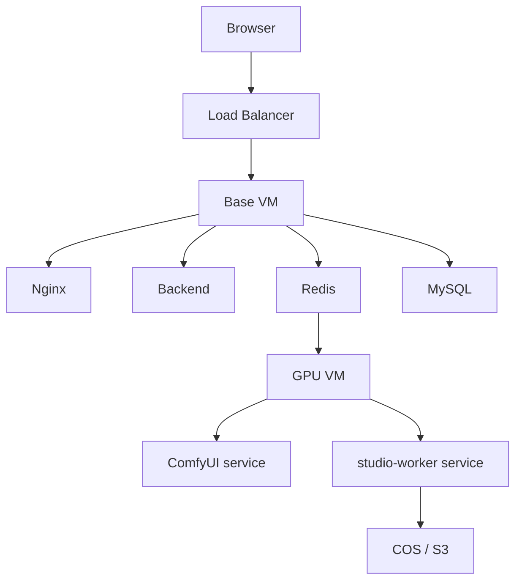

# TWCC 正式上線 SOP

> 用途：提供一次完整、正式、可執行的 TWCC MVP 上線流程。
> 對象：DevOps、維運工程師、下一位執行 Agent。

---

## 1. 適用架構



---

## 2. 上線總原則

1. 先起 Base VM，再起 GPU Node。
2. 先驗證服務存活，再驗證任務流。
3. 先驗證靜態與健康檢查，再驗證圖片生成與 WebSocket。
4. 若任一步失敗，先停在當前層排錯，不要盲目往下走。

---

## 3. Base VM 正式啟動步驟

### Step 1：登入 Base VM

```bash
ssh ubuntu@<BASE_VM_PUBLIC_IP>
cd /path/to/project
```

### Step 2：放置環境檔

```bash
cp .env.twcc .env
nano .env
set -a
source .env
set +a
```

確認至少填好：

1. `REDIS_PASSWORD`
2. `MYSQL_ROOT_PASSWORD`
3. `DB_PASSWORD`
4. `SECRET_KEY`
5. `S3_ENDPOINT`
6. `S3_BUCKET`
7. `S3_ACCESS_KEY`
8. `S3_SECRET_KEY`

補充：

1. `set -a; source .env; set +a` 會把 `.env` 載入目前 shell，後續 `docker compose exec` 和測試指令才能直接使用 `$REDIS_PASSWORD`、`$MYSQL_ROOT_PASSWORD` 等變數。

### Step 3：先啟 MySQL

```bash
docker compose -f docker-compose.base.yml --env-file .env up -d mysql
docker compose -f docker-compose.base.yml ps
```

### Step 4：初始化資料庫

若有 schema：

```bash
docker compose -f docker-compose.base.yml exec mysql \
  mysql -u root -p"$MYSQL_ROOT_PASSWORD" studio_db < backend/schema.sql
```

### Step 5：啟動 Base VM 全部服務

```bash
docker compose -f docker-compose.base.yml --env-file .env up -d
docker compose -f docker-compose.base.yml ps
docker compose -f docker-compose.base.yml logs -f
```

### Step 6：驗證 Base VM

```bash
curl -I http://localhost
curl http://localhost/health
curl http://localhost/api/health
docker compose -f docker-compose.base.yml exec redis redis-cli -a "$REDIS_PASSWORD" --no-auth-warning ping
docker compose -f docker-compose.base.yml exec mysql mysql -u root -p"$MYSQL_ROOT_PASSWORD" -e "SELECT 1;"
bash scripts/twcc_healthcheck.sh
```

成功標準：

1. Nginx 可回應
2. `/health` 與 `/api/health` 可回應
3. Redis `PONG`
4. MySQL 正常
5. 健康檢查腳本無 FAIL

---

## 4. GPU Node 正式啟動步驟

### Step 1：登入 GPU VM

```bash
ssh ubuntu@<GPU_VM_PUBLIC_OR_PRIVATE_IP>
cd /opt/studio-worker
```

### Step 2：檢查 `.env.twcc`

確認：

1. `GPU_VM_REDIS_HOST` 已填 Base VM 私網 IP
2. `COMFY_HTTP_TIMEOUT=300`
3. `WORKER_TIMEOUT=3600`
4. `TWCCLI_PATH` 指向可執行的 `twccli`

若要在 shell 中手動測試 Redis 連線，先執行：

```bash
set -a
source .env.twcc
set +a
```

### Step 3：執行 GPU 安裝腳本

```bash
sudo bash scripts/twcc_gpu_setup.sh
```

### Step 4：啟動 systemd 服務

```bash
sudo systemctl daemon-reload
sudo systemctl enable --now comfyui
sudo systemctl enable --now studio-worker
sudo systemctl status comfyui
sudo systemctl status studio-worker
```

### Step 5：檢查 GPU 節點日誌

```bash
journalctl -u comfyui -n 100 --no-pager
journalctl -u studio-worker -n 100 --no-pager
```

### Step 6：驗證 GPU 節點

```bash
curl http://127.0.0.1:8188/system_stats
redis-cli -h <BASE_VM_PRIVATE_IP> -p 6379 -a "$REDIS_PASSWORD" --no-auth-warning ping
```

成功標準：

1. `comfyui` active
2. `studio-worker` active
3. ComfyUI API 有回應
4. GPU VM 可以連 Base VM Redis

---

## 5. LB 與前端正式驗證

### Step 1：從外網打開 LB 網域

```text
https://<LB_DOMAIN>
```

### Step 2：檢查前端 API 請求

用瀏覽器 DevTools Network 確認：

1. API 請求不是 `localhost`
2. API 請求走同源路徑
3. 沒有 Mixed Content

### Step 3：驗證上傳與生成

至少執行：

1. 小圖上傳
2. 接近 50MB 的測試素材上傳
3. 一個超過 60 秒的生成任務

### Step 4：驗證輸出

檢查：

1. Backend 記錄任務完成
2. COS 中出現輸出檔案
3. 前端可開啟輸出 URL

---

## 6. WebSocket 驗證 SOP

如果目前前端有即時進度功能，請執行：

1. 開 DevTools 的 WS 分頁
2. 啟動一個長任務
3. 觀察 `/ws/` 是否成功升級
4. 觀察任務期間連線是否保持

若失敗，優先檢查：

1. Nginx `/ws/` 設定
2. LB idle timeout
3. Backend 是否真的提供對應 WebSocket 路徑

---

## 7. 上線後 30 分鐘觀察清單

### Base VM

1. `docker compose -f docker-compose.base.yml ps`
2. `docker compose -f docker-compose.base.yml logs --tail=200`
3. `bash scripts/twcc_healthcheck.sh`

### GPU Node

1. `systemctl status comfyui`
2. `systemctl status studio-worker`
3. `journalctl -u studio-worker -n 200 --no-pager`

### 功能面

1. 前端首頁可開
2. 可登入 / 操作
3. 可提交生成
4. 可取得輸出

---

## 8. 回滾原則

若正式上線失敗：

1. 不先動 GPU Node，先確認 Base VM 與 LB 是否正常
2. 若是生成鏈失敗，先停 `studio-worker`，保留 Base VM 對外服務
3. 若是 Nginx / API 問題，先回滾 Base VM 上最近修改的配置檔，再重啟 compose

---

## 9. 正式交付標準

以下全部成立才算完成上線：

1. Base VM 所有容器正常
2. GPU Node 兩個 systemd 服務正常
3. 前端同源 API 正常
4. 可完成一次上傳、生成、存到 COS、前端取回
5. `openspec validate harden-twcc-mvp --strict` 仍然通過